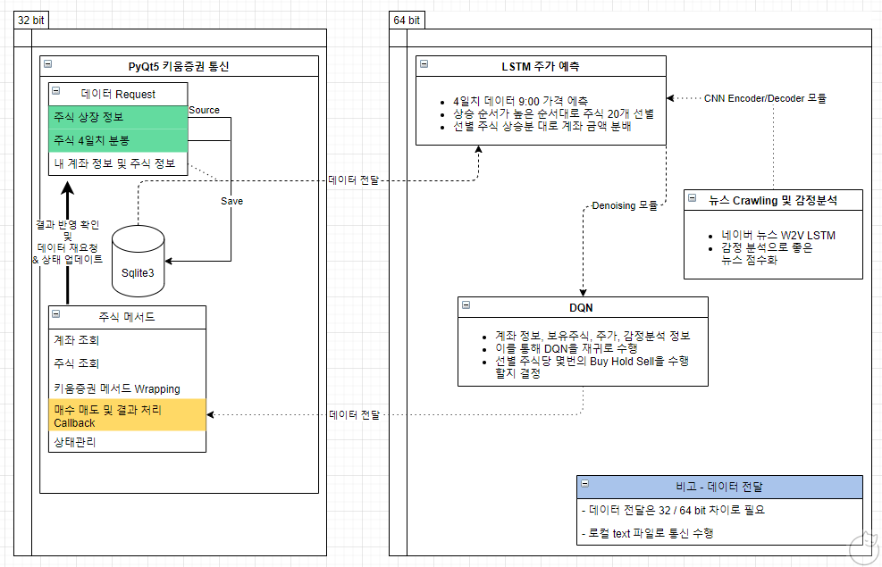
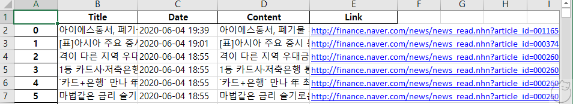
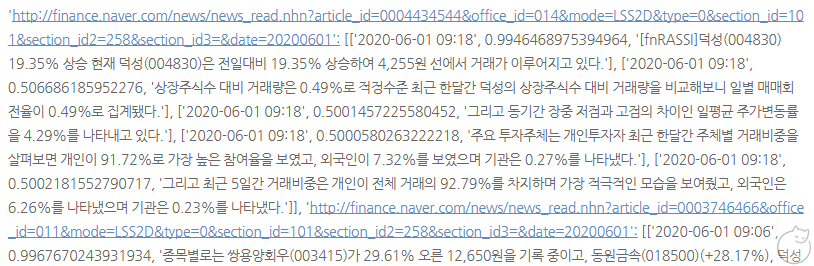
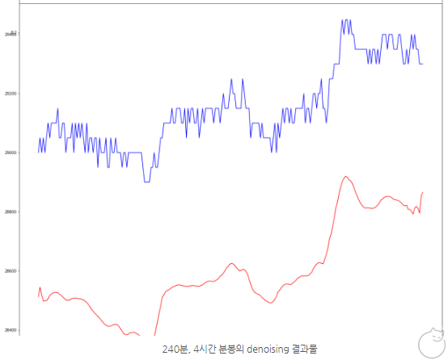

# Stock - Automated Trading Using Machine Learning

Tensorflow/Keras, LSTM, CNN, AutoEncoder Decoder for automated Stock Trading in Python 
Tensorflow/Keras, LSTM, CNN, AutoEncoder Decoder 를 이용한 주식 자동화 트레이딩 - 파이썬 

 

요약 : PyQT5를 통해 키움증권사에서 비동기로 주식 데이터 input을 받은 이후, **`특정 시점에서 LSTM으로 주가를 예측하고, 자산을 분배하여, Buy/Hold/Sell을 DQN으로 분단위로 결정`**

> 구동 환경:
>
> 1. Python 3.7
> 2. Tensorflow 1.15
> 3. Windows 10

 
 

**전체 Flow 도식도 :**

- 초기 9:00 예측 이후, 계속 데이터를 받으면서 현재 시점에서 주가 예측, 예산 분배 및 DQN으로 매수매도 판단 반복
- 수익률이 설정한 -3% 보다 낮아지면 해당 종목 손절
- 에러 발생시 키움증권 데이터와 다시 동기화 실행

 

**사용한 프레임워크 & 라이브러리 :**

> ※ 정확도 향상을 위해 Tensorflow에서 Keras로 바꿈
>
> 1. 주식 뉴스 Crawling 모듈 : W2V, komoran, bs4
> 2. 주가 Denosing 모듈 : Keras, CNN
> 3. 데이터 Encoder / Decoder 모듈 : tensorflow
> 4. 키움 증권 통신 모듈 : PyQT5, sqlite3, transitions.Machine(상태관리)
> 5. 주가 예측 Predicter 모듈 : Keras, LSTM
> 6. 주가 트레이딩 Trader 모듈 : Keras

---

 

## Table of Contents

<!-- https://github.com/didghwns0514/stock_price_prediction -->

- Sections
  - [Automated-Stock-Trading](https://github.com/didghwns0514/stock_price_prediction/blob/master/README.md#Automated-Stock-Trading)
  - [Usage](https://github.com/didghwns0514/stock_price_prediction/blob/master/README.md#Usage)
  - [Maintainer](https://github.com/didghwns0514/stock_price_prediction/blob/master/README.md#Maintainer)

 
 

## Sections

---

### Automated-Stock-Trading

**Status :** Used Local PC for training and Calculating DQN/LSTM with powerful GPU

**Used :**

1. 주식 뉴스 Crawling 모듈

   - 사용 : W2V, komoran, bs4
   - 절차
     1. BS4를 이용하여 뉴스 수집
        
     2. 키움증권에서 가져온 상장 회사 이름에 대해 모든 증권 뉴스의 문장을 부여하고  
        경과 시간 및 Sentimental 분석을 합쳐 점수화를 수행
        - Syntax : 링크주소, 날짜, 0~1 점수값 (0-> 나쁨 0.5->중립 1.0-> 좋음), 원본 문장
          

2. 주가 Denosing 모듈

   - 사용 : Keras, CNN
   - 절차
     1. 주가 데이터의 Noise를 최대한 제거하여 Feature를 잘 찾을 수 있도록 Denoising 과정 수행
        

3. 데이터 Encoder / Decoder 모듈

   - 사용 : tensorflow
   - 절차
     1. 주식 뉴스 데이터의 감정분석과, 해당 뉴스의 경과 시간에 따른 Feature를 추출하기 위해 사용

4. 주가 예측 Predicter 모듈

   - 사용 : Keras, LSTM
   - 절차
     1. Denoising 된 주가를, Encoding된 뉴스 감정분석 결과와 같이 사용하여 주가 예측에 사용
     2. 시계열 데이터는 Future data를 반영하는 등의 오류에 민감하기 때문에, 이를 유의하여 Scaling 및 학습/검증/답 데이터를 분류하여, 금일 모아진 주식 데이터에 대해 학습을 수행
     3. 학습된 LSTM은 금일 기준의 base LSTM이고, 개별 주식에 빠르게 적용하기 위해 전이학습 이용 -> 성과가 좋지는 않음

5. 주가 트레이딩 Trader 모듈
   - 사용 : Keras
   - 절차
     1. Denoising 된 주가를, Scaling 하여 Buy/Sell/Hold를 결정
     2. 재귀적으로 결정을 탐색하여 총 몇번의 Buy / Sell 혹은 Hold 를 유지할지 결정
        > N 번의 재귀에 대해, N+1에서 다른 결정이 나온 경우 다음의 의사결정을 따름
        - Buy \* n + (Sell or Hold) => Buy \* n
        - Sell \* n + (Buy or Hold) => Sell \* n
        - Hold \* n + (Buy or Sell) => Hold
6. 키움 증권 통신 모듈 : PyQT5, sqlite3, transitions.Machine(상태관리)
   - 특징
     1. 키움증권과 비동기 통신 구현
     2. PyQT5의 Timer 기능을 이용, 정해진 시간에 각 State에 맞는 역할을 수행
     3. 64bit에서 받은 Trading 결과를 이행
     4. 에러 발생시 다시 재시작 후, 키움증권을 재연결하고 데이터 다시 동기화

 

---

### Usage

**Simple usage :**

- KIWOOM_API\_\_MAIN.py : Run
- 요구사항
  1. 키움증권 HTS
  2. Window OS

---

### Maintainer

**People**: Yang HoJun(양호준)(didghwns0514@gmail.com)

**More Info:**

- Github link : [Link](https://github.com/didghwns0514/stock_price_prediction)
- Personal Blog : [Link](https://korshika.tistory.com/)

**Suggestions:**

- Feel free to contact

---

## Definitions

_These definitions are provided to clarify any terms used above._

- **Documentation repositories**: Feel free to share. Thank you!
